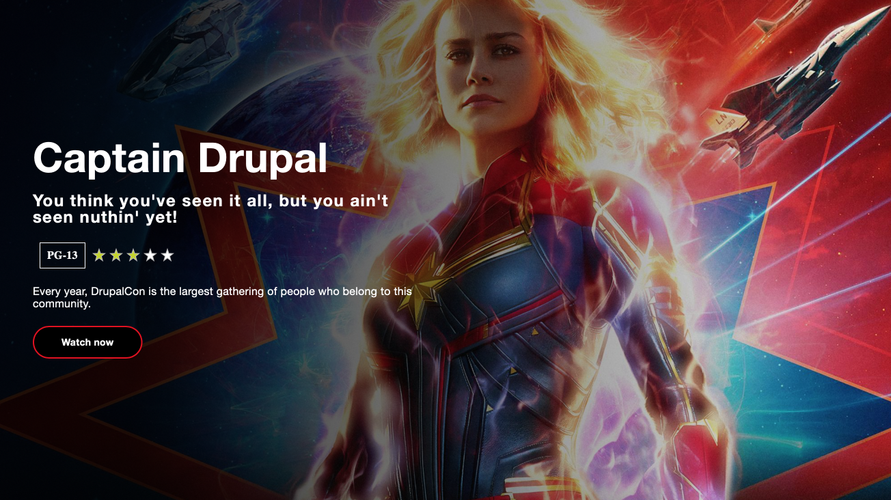

# Featured Movie



The Featured Movie component, much like the Movie Card, presents similar requirements for field collections, which we will address pretty much the same way we did for the Movie card.

Let's start by creating the usual files for building the component:

1. Inside `nitflex_dev_theme/src/_patterns/01-patterns/` create a new directory called **featured-movie**
2. Inside the **featured-movie** directory create these files:
   * `featured-movie.yml`, `featured-movie.scss`, and `featured-movie.twig`
3. Add the following code snippet into **featured-movie.yml**:

```yaml
cover_image: "",
heading:
  heading_level: 2
  modifier:
  title: "DrupalCon Seattle 2019"
  url: "#"
promo_text: Be part of th 12th season this fall,
mpaa_rating: PG-13,
average_rating: 5,
synopsis: Duis mollis, est non commodo luctus, nisi erat porttitor ligula, eget lacinia odio sem nec elit.,
watch_button:
  text: "Watch now"
  url: "#"
```

* Add the following code to **featured-movie.twig**:

```php
{{ attach_library('nitflex_dev_theme/featured-movie') }}

<section class="featured-movie {{ attributes ? attributes.class }}"{{ attributes ? attributes|without(class) }}>
  {{ title_prefix }}
  {{ title_suffix }}
  
    <div class="featured-movie__cover-image">
      {{ cover_image }}
    </div>
  
  <div class="featured-movie__meta">
    <div class="featured-movie__title">
      
    </div>
    
      <div class="featured-movie__promo">
        
      </div>
    
    <div class="featured-movie__settings">
      <div class="featured-movie__favorites-toggle">
        
          
        
      </div>
      
        <div class="featured-movie__mpaa-rating">
          
        </div>
      
      
        <div class="featured-movie__average-rating">
          
        </div>
      
    </div>
    
      <div class="featured-movie__synopsis">
        {{ synopsis }}
      </div>
    
    
      <div class="featured-movie__cta">
        
      </div>
    
  </div>
</section>
```

1. Finally, Add the following code to **featured-movie.scss**:

```css
// Import site utilities
@import '../../00-global/utils/init';

.featured-movie {
  align-items: center;
  background: $color-black;
  display: flex;
  height: 480px;
  overflow: hidden;
  position: relative;
  width: 100%;

  @include breakpoint($bp-sm) {
    height: 640px;
  }

  @include breakpoint($bp-lg) {
    height: 740px;
  }
}

.featured-movie__cover-image {
  background-color: $color-black;
  height: 100%;
  left: 0;
  position: absolute;
  top: 0;
  width: 100%;

  &::after {

    @include breakpoint($bp-md) {
      background-image: linear-gradient(to right, $color-black 15%, rgba($color-black, 0) 100%);
      content: '';
      display: block;
      height: 100%;
      opacity: 0.85;
      left: 0;
      position: absolute;
      top: 0;
      width: 100%;
    }
  }

  img {
    @include center-align($position: absolute);
    height: 110%;
    opacity: 0.35;
    max-width: none;
    width: auto;
    z-index: $zi-ground;

    @include breakpoint($bp-md) {
      opacity: 1;
    }

    @include breakpoint($bp-lg) {
      height: auto;
      max-width: none;
      width: 110%;
    }
  }
}

.featured-movie__meta {
  color: $color-white;
  display: flex;
  flex-wrap: wrap;
  padding: 20px;
  position: relative;

  @include breakpoint($bp-sm) {
    padding: 20px 40px;
  }

  @include breakpoint($bp-md) {
    padding: 40px 50px;
    max-width: 50%;
  }
}

.featured-movie__title {
  width: 100%;

  .heading {
    font-size: 4.8rem;
    line-height: 1;

    @include breakpoint($bp-lg) {
      font-size: 6rem;
    }
  }
}

.featured-movie__promo {
  font-size: 1.8rem;
  font-weight: $font-weight-bold;
  padding: 12px 0;
  width: 100%;

  @include breakpoint($bp-md) {
    font-size: 2.4rem;
  }

  .eyebrow {
    text-transform: none;
    white-space: normal;
  }
}

.featured-movie__settings {
  align-items: center;
  display: flex;
  padding: 12px 0;
}

.featured-movie__favorites-toggle {
  margin-right: 10px;
}

.featured-movie__mpaa-rating {
  margin-right: 10px;

  .mpaa-rating {
    border-color: $color-white;
    color: $color-white;
  }
}

.featured-movie__synopsis {
  font-size: 1.4rem;
  padding: 12px 0;
  width: 100%;

  @include breakpoint($bp-sm) {
    font-size: 1.6rem;
  }
}

.featured-movie__cta {
  padding: 12px 0;
  width: 100%;
}
```


**Featured Movie Library**

Be sure to create the **featured-movie** library and attach it to the component.


## Breaking it down

By now you should have a good understanding of what we are doing here.

1. First we built a JSON object in which we outlined each of the fields the featured movie component needs. These fields include the movie _title_, _average rating_, _MPAA rating_, _add to favorites_ button as well as a _watch movie_ button.
2. Next we wrote the markup in twig which makes use of the data from the JSON object. Most of this data is being passed to the component in the way of twig includes which makes use of previously built components such as heading, eyebrow and button.
3. Finally we wrote the css styles to give the featured movie component the look and feel we want.

## Compiling the style-guide

Now that we have written all the necessary code to build the Featured Movie component, it's time to see the component in the style-guide. Let's compile our project first.

* In your terminal or command line, navigate to `/themes/custom/nitflex_dev_theme` and run the following command:

```bash
lando npm run build && lando php patternlab/core/console --generate
```

## Viewing the component <a id="viewing-the-component"></a>

* Open your Drupal site and point to the URL below: [http://nitflex.lndo.site/themes/custom/nitflex\_dev\_theme/dist/style-guide/?p=viewall-patterns-featured-movie](http://nitflex.lndo.site/themes/custom/nitflex_dev_theme/dist/style-guide/?p=viewall-patterns-featured-movie)

Under the Components category you should see the new Featured Movie component.

