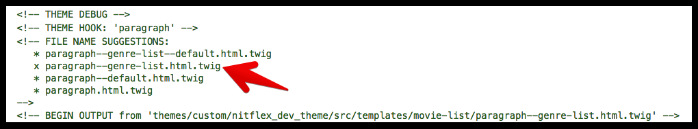

# Movie List

The same way we built the movie card collection and movie listing components in two parts, we will also integrate them in two parts. We already integrated the collection of cards and now we are going to integrate the full movie listing, which would include the collection of cards, and the title of the list.

## Template suggestions

Within Drupal, the movie listing is set up as a **Movie Genre List** paragraph type which includes a title field and a views reference field. The views reference field uses the `movie_list` view that we integrated as the **movie-card-collection** in the previous exercise. The same way we created a new twig template suggestion for previous components, we are going to repeat that process for the movie-listing, targeting the paragraph template for Movie Genre List paragraph type.

The twig template has already been added to the `nitflex_dev_theme`, but If you were doing this on your own, you would follow the next steps.

1. Use your browser inspector to view twig debug comments for the location of the default paragraph template \(`modules/contrib/paragraphs/templates/paragraph.html.twig`\)
2. Copy the default template to the appropriate directory in the `nitflex_dev_theme`\(`/themes/custom/nitflex_dev_theme/src/templates/movie-list`\) and rename  `paragraph--genre-list.html.twig`



## Integrate the Movie Listing

1. Open`paragraph--genre-list.html.twig`in your text editor
2. Remove all code in the file but leave all comments.
3. Paste the following code at the bottom of the template:



```php


  
    {{ list }}
  

```



Let's go over what we are doing here:

* We're again using the `embed` option to pull in the movie-listing component because just like with the integration of previous components we are going to let Drupal take care of rendering the list of movies through a twig block we set up in the component.
* We're passing in the Drupal attributes like we have done previously, and mapping the title field for the paragraph to the `list_title` variable in the component.
* We're also setting a variable for the list that Drupal is provided through the movie listing views reference field in the paragraph type. This `list` variable is then output inside the twig block tag.

So far things are looking good, but we've got one issue: just like with the featured movie's promo sentence, the default Drupal field markup is coming in with our list title field. This means we've got a `<div>` tag inside our `<h3>` tag. To fix this, we'll create a custom field template suggestion file for the list title field. The template suggestion file has already been added to the `nitflex_dev_theme`, but If you were doing this on your own, you would follow the next steps:

1. Use your browser inspector to view twig debug comments for the location of the default field template \(`modules/core/themes/stable/templates/field.html.twig`\)
2. Copy the default template to the appropriate directory in the `nitflex_dev_theme`\(`/themes/custom/nitflex_dev_theme/src/templates/movie-list`\) and rename `field--paragraph--field-list-title--genre-list.html.twig`


Now, open the `field--paragraph--field-list-title--genre-list.html.twig` file, remove all code in the file but leave all comments, and paste in:



```php

  <span{{ attributes }}>{{ item.content }}</span>

```



This reduces the template down to just outputting the field's value that's wrapped with a `<span>` tag, which is where any Drupal-specific classes can go.

Now the list title will have the correct markup.

