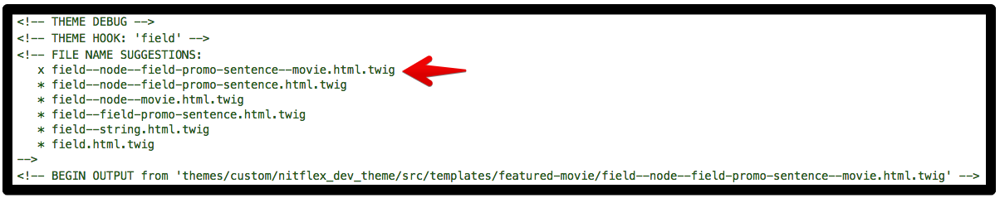

# Featured Movie

We are now ready to integrate the featured movie component with Drupal. Lucky for us, we have already done something very similar when we integrated the movie card component with the movie content type. Let's start.

## View modes

We are going to follow the exact same steps for using view modes as we did when we integrated the [movie card component](https://mariohernandez.gitbook.io/components/chapter-6/integrating-components/movie-card#integrating-the-movie-content-type). However, this time we're going to use a view mode called **Featured Movie**. This view mode is already set up, but here are the steps to create it should you want to practice:

1. Log into the site with admin access
2. Click **Structure** \| **Display modes** \| **View modes**
3. Click the **Add view mode** button, then click the **Content** link on the "_Choose view mode entity type_" list.
4. Name the view mode "Featured Movie"

After that, the steps will be the same as with the move card component, starting with Step 5, making sure the **Featured Movie** view mode is enabled.

Next Steps:

* Step 6 in the movie card integration will use view mode **Featured Movie** instead of **Teaser**
* Step 7 should be updated to also use **Featured Movie**
* For step 8 enable the following fields \(move them outside of **Disabled** section\):
  * _Cover Image_, _Promo Sentence_, _MPAA Rating_, _Average Viewer Rating_, _Flag: Favorites_, and _Synopsis_. All other fields should be under **Disabled**.

## Template suggestions

The template suggestion for the **Featured Movie** view mode has already been created for you, but if you were doing this on your own, follow the same steps that we took for creating the template suggestion for the Teaser view mode in the [Movie card](https://mariohernandez.gitbook.io/components/~/drafts/-L_5auZz2Ggm-Z6dxctc/primary/chapter-6/integrating-components/movie-card#template-suggestions) integration instructions, but this time our template suggestion should be **node--movie--featured-movie.html.twig**.

## Integrating Featured Movie component

We are now finally at a point where we can integrate the Featured Movie component with the Movie content type using the newly created template suggestion.

1. Open `node--movie--featured-movie.html.twig` in your text editor
2. Remove all code in the file but leave all comments. It is good to leave the comments untouched as this provides helpful information regarding available variables and other useful Drupal specific details.
3. add the following code at the bottom of the template

```php






{% embed '@patterns/featured-movie/featured-movie.twig' with
  {
    attributes: attributes,
    title_prefix: title_prefix,
    title_suffix: title_suffix,
    heading: heading,
    cover_image: content.field_main_image|render|trim is not empty ? content.field_main_image,
    mpaa_rating: content.field_mpaa_rating|render|trim is not empty ? content.field_mpaa_rating,
    promo_text: content.field_promo_sentence|render|trim is not empty ? content.field_promo_sentence,
    average_rating: content.field_average_viewer_rating|field_value,
    synopsis: content.body|render|trim is not empty ? content.body,
    watch_button: watch_button,
    flag: content.flag_favorites
  } only
%}

  
    {{ flag }}
  

```

Let's go over what we are doing here:

* First, as mentioned in the introduction to Chapter 5, we're triggering a full render of the content variable.
* Next, we are setting up a variable that will include the values for the **heading** of the movie card that are based on variables Drupal provides. If you notice starting around line 18 in the comments of our template file, the _label_ variable is the Node's title, and the _url_ variable is the node's URL. In addition, notice that the _heading_ variable we are creating is modeled after the _**heading**_ component's [YAML object](https://mariohernandez.gitbook.io/components/~/drafts/-L_4qJ97wL1R7eH6ZDkg/primary/chapter-4/building-components/2-heading#improving-the-heading-component).
* Next we are setting up a variable that will include the values for the **button** \(Watch now button\).
* Next we use an `embed` twig statement to integrate the Featured Movie component. In the embed we are mapping all the Featured Movie fields with Drupal's data. We also pass in Drupal-specific items such as _title\_prefix_, _title\_suffix_, _attributes_, etc.
* Notice how with the average viewer rating field we are making use of the `field_value` filter that's provided by the [Twig Field Value](https://www.drupal.org/project/twig_field_value) module to pass in the raw value of that field. This is because in our template for the Average Viewer Rating component we're expecting a simple number for a data attribute, so if it were to include any markup it would break our component!
* Finally we make use of the `favorites_toggle` twig block tag that we set up in the featured movie component to swap out what is output in that area of the component. We're instead letting Drupal render the flag field as provided by the flag module. It's like we're telling Drupal "Use **our** component with your field values, except for the add-to-favorites button -- take care of that one for us, would ya?"


Learn more about [Twig's embed](https://twig.symfony.com/doc/2.x/tags/embed.html) statements to extend and include twig templates.


Things are looking good, but we've got one issue: in our **featured-movie** component we're making use of the **eyebrow** component to output the promo sentence. The eyebrow component makes use of a `<p>` tag, and since we're passing the Drupal-rendered version of the field, it includes all the default markup Drupal adds.

To fix this, we'll create a custom field template suggestion file for the promo sentence field. The template suggestion file has already been added to the `nitflex_dev_theme`, but if were adding it on your own you would:

1. Open the site's homepage \(i.e. `/homepage`\)
2. Use your browser inspector to view twig debug comments for the location of the default field template \(`modules/core/themes/stable/templates/field.html.twig`\)
3. Copy the default template to the appropriate directory in the `nitflex_dev_theme`\(`/themes/custom/nitflex_dev_theme/src/templates/featured-movie`\) and rename it to `field--node--field-promo-sentence--movie.html.twig`



Now, open the `field--node--field-promo-sentence--movie.html.twig` file, remove all code in the file but leave all comments, and add in:

```php

  <span{{ attributes }}>{{ item.content }}</span>

```

This reduces the template down to just outputting the field's value that's wrapped with a `<span>` tag, which is where any Drupal-specific classes can go.

Now our promo sentence in a featured movie will have the correct markup.

### Clear Drupal's caches.

* Use the admin menu to flush all caches
* Or run this command:

```bash
lando drush cr
```

If you refresh the homepage you should see that the featured movie now inherits the styles we wrote when we created the component.

