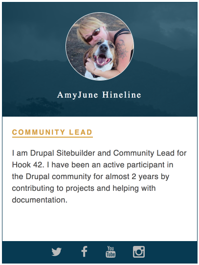

# Component-based Development with Drupal 8

## 1 - Building Components
This training is broken down in three parts:  Building Components, Preparing Drupal for Components, and finally, Integrating components with Drupal.

### 1.1 - Generating the styleguide
Before we can build components, we need to generate a living styleguide to host our components.  For the purpose of this training, we will use [KSS Node](https://github.com/kss-node/kss-node) to build our living styleguide.  KSS Node is a methodology for documenting CSS and generating styleguides.  Fortunately, Mediacurrent's theme generator already provides KSS Node fully integrated with our new Drupal theme.

If you already created a new theme or used the provided `badcamp` theme, and compiled the theme, you already have a styleguide in place.  You can view the styleguide by going `http://your-local/themes/custom/badcamp/dist/style-guide/`.  Feel free to take a look around the styleguide, we will get into it in more detail as the training progresses.

### 1.2 Creating a basic component (Eyebrow)

Before we went into the more advance stuff, let's start by creating a super simple component.  The component name is **Eyebrow** and this is a component you would normally use to label or categorize content content.

A typical component would have 3 files: `component-name.json`, `component-name.scss`, and `component-name.twig`.  Later we will use Mediacurrent's theme generator to build our components but for the purpose of understanding thing better, let's crete the Eyebrow component by hand

* Inside the **badcamp/src/components/** directory, create the files we discussed above, but use `eyebrow` as the component name.  So you shoud end up with `eyebrow.json`, `eyebrow.scss`, and `eyebrow.twig`.

* Inside `eyebrow.json` copy the following code:

```
{
  "eyebrow": "Community Lead",
  "class": ""
}
```

We just created a JSON object with a variable of **eyebrow** and value of **Community Lead**.  We will get deeper into JSON object when we build more advance components.

* Inside `eyebrow.twig` copy the following code:

```
<h3 class="eyebrow">{{ eyebrow }}</h3>
```

The twig template allows us to write the markup we deem most appropriate for our components.  In addition, we are passing data from the JSON object we wrote above.  We will get into more details about twig templates.

* Inside `eyebrow.scss` copy this code:

```
// Eyebrow
//
// This is the eyebrow component.
//
// Markup: eyebrow.twig
//
// Style guide: Components.eyebrow

// Import site utilities.
@import '../../global/utils/init';

.eyebrow {
  border-bottom: 2px solid #DAA520;
  display: inline-block;
  line-height: 1;
  color: #DAA520;
  text-transform: uppercase;
  font-size: 1.2rem;
  padding-bottom: 2px;
  white-space: nowrap;
  letter-spacing: 0.15rem;
}
```

Above are the styles that give the Eyebrow component a more appealing look.  Notice the commended code at the top of the file.  Those comments is what KSS Node uses to generate the component in the styleguide.  In fact, let's compile the styleguide now so the Eyebrow component can be available

* Inside `badcamp`, run this command

```
npm run styleguide
```

Now let's take a look at the styleguide by going

```
http://your-local/themes/custom/badcamp/dist/style-guide/
```


### 1.2 - Creating our first component (Speaker card)
During this training we will build a page that list speakers and their profiles.  One of the advantages of components is being able to reuse them and even alter them without having to rebuild from scratch.  We will start by building a **Speaker** card component which will consist of a speaker photo, name, short bio and social media channels to connect with the speaker.

Once our single component is ready, we will create a page in which we reuse the speaker component to list as many speakers as we need by passing data from Drupal to populate each speaker card.

#### Let's create the Spekaer component now

Inside the `badcamp` directory do one of these two things:
1. If you are using Mediacurrent's theme generator:
   * Run `npx -p yo -p generator-mc-d8-theme -c 'yo mc-d8-theme:component "Speaker"'`

A new component, **speaker**, will be created inside `/src/components/`.  Inside the **speaker** component you will notice 3 files: `speaker.json`, `speaker.scss`, and `speaker.twig`.  We will go over these files in more detail later.

2. If you are NOT using Mediacurrent's theme generator,  you can create the component by hand.
   * Inside `src/components/` create a new directory called **speaker**.
   * Inside the **speaker** directory, create the 3 files listed above (`speaker.json`,`speaker.scss`, and `speaker.twig`).


### 1.2.1 - Creating data source for our component
In order to see our component in the styleguide, we need to provide stock/dummy content.  Our speaker component looks at the `speaker.json` file for all of its content.  We could actually hard-code our content in the twig template but using **.json** allows us to separate data from presentation.

> **_NOTE_**
> If you used the theme generator to create your **speaker** component, you should notice **speaker.json** already has content.  I'd say copy the code snippet below and replace the current content in the **speaker.json**.  If you did not use the theme generator to create your **speaker** component your **speaker.json** will be empty.  Copy the code below into it.

**speaker.json**
```json
{
  "name": "AmyJune Hineline",
  "photo": "",
  "type": "Community Lead",
  "bio": "I am Drupal Sitebuilder and Community Lead for Hook 42. I have been an active participant in the Drupal community for almost 2 years by contributing to projects and helping with documentation.",
  "items": [
    {
      "icon": "twitter",
      "url": "#"
    },
    {
      "icon": "facebook",
      "url": "#"
    },
    {
      "icon": "instagram",
      "url": "#"
    },
    {
      "icon": "youtube",
      "url": "#"
    }
  ],
  "class": ""
}
```
The code above is a JSON object.  JSON objects are written in `key/value` pairs.  The **key** is a variable we can later pass to Drupal to map data to our component.  More on this later.

We have created individual variables for each of the fields of the Speaker component.  However, for the social media icons we have created an array which holds the url and name of the social channel.  This array will allow us to add as many or as little social media channels per speaker.


### 1.2.2 - Writing Twig Markup
The next step in the process is to write the markup the **speaker** components needs to be rendered.  In addition, we will pass the data from the JSON object we created in the previous step.

**speaker.twig**
```php
{{ attach_library('badcamp/speaker') }}
<article class="speaker {{ class|default('') }}">

<div class="speaker__header">
  <div class="speaker__photo">
    {{ photo }}
  </div>
  <h2 class="speaker__name">{{ name }}</h2>
</div>


  <div class="speaker__content">
    
    
      <p class="speaker__bio">{{ bio }}</p>
    
  </div>



  <div class="speaker__social-icons--wrapper">
    
  </div>

</article>
```
Using [BEM](https://css-tricks.com/bem-101/) to name our css classes, the speaker component's markup is now in place.  In addition, we are passing the json data using twig syntax.  We opted to use conditionals (`if` statements) for each field to ensure there is data in each field before it is rendered.

We will discuss in detail during training everything inside the twig template to ensure everyone has a full understanding of what's happening.  For now, proceed with the instructions.


### 1.2.3 - Writing CSS Styles
The final step in this process is to write the styles to make our component look and feel as shown in our design comps.  Copy all of the code below into your **speaker.scss**

**speaker.scss**
```css
// Speaker
//
// This is the speaker component.
//
// Markup: speaker.twig
//
// Style guide: Components.Speaker

// Import site utilities.
@import '../../global/utils/init';

.speaker {
  border: 1px solid #003954;
  max-width: 400px;
  position: relative;
}

.speaker__header {
  background: #003954 url('../assets/speaker-bg.png') 0 0 no-repeat;
  line-height: 0.8;
  padding: 20px 0;
  position: relative;
}

.speaker__photo img {
  border-radius: 50%;
  display: block;
  width: 140px;
  height: 140px;
  margin: 0 auto 20px;
  border: 1px solid #003954;
}

.speaker__name {
  // @include font-secondary;
  color: $color-white;
  font-size: 18px;
  font-weight: 400;
  letter-spacing: 0.15rem;
  line-height: 1;
  text-align: center;
  width: 100%;
}

.speaker__content {
  margin: 20px;
  min-height: 250px;
  overflow: hidden;
  margin-bottom: 30px;
}

.speaker__eyebrow {
  margin-bottom: 20px;
}

.speaker__social-icons--wrapper {
  background: #003954;
  padding: 10px 0;
  height: 45px;
  width: 100%;
  position: absolute;
  bottom: 0;
}

.speaker__social-icons {
  display: flex;
  justify-content: space-between;
  line-height: 1;
  margin: 0 auto;
  width: 200px;

  .social-icon--img {
    fill: $color-white;
  }
}
```

Another advantage of components is their unique name makes our css styles easy to read and easier to maintain.  If you notice there is no nesting at all in our styles which makes overriding styles very easy if needed.


### 1.3 - Creating the speaker library
Libraries are the recommended way for adding CSS and JavaScript to pages in Drupal 8.  Although our component is not talking to Drupal yet, we will add the "Speaker" library so it's ready when we need to use it in Drupal.  Also, creating the library now feels natural since we are working with the Speaker component.

* Open your **libraries.yml** file located in your theme's root (i.e. `badcamp.libraries.yml`).  If your theme name is not badcamp, your libraries.yml file will include your theme's name.

* Since our theme was created using Mediacurrent's Theme Generator, your libraries.yml probably includes examples of how to declare libraries for Drupal to consume.  Take a moment to review the commented code in the libraries file for ideas on how libraries work or visit this page to learn more about [Drupal 8 Libraries](https://www.drupal.org/docs/8/theming-drupal-8/adding-stylesheets-css-and-javascript-js-to-a-drupal-8-theme).

* Add the following code snippet somewhere in your `badcamp.libraries.yml` file to create the Speaker library

```
speaker:
  css:
    component:
      dist/css/speaker.css: {}
```
 * Since our compiling gulp task compiles all CSS into `dist/css/filename.css`, we are indicating in the Speaker library that any CSS the Speaker component needs will be located in `dist/css/speaker.css`.

 * Should our component need Javascript, we would append to our Speaker library the location of the JavaScript file, like this:

**Example of Speaker library including JavaScript**
```
 speaker:
  css:
    component:
      dist/css/speaker.css: {}
  js:
    js/speaker.js: {}
```

* **speaker**: Name of library used when attaching it to any twig template.  See **speaker.twig** above and you will notice first line includes the following: `{{ attach_library('badcamp/speaker') }}`.  As previously mentioned, the library is only used by Drupal.  The styleguide does not need the library to render CSS or Javascript as these are included globally within KSS Node.

* **css/js**:  This indicates whether we are including CSS or Javascript to our library.

* **component**:  This determines a file organization and aggregation strategy used by Drupal.  Drupall follows a SMACSS-style categorization of its CSS rules.  Read more about the [separation of concern for CSS as well as file organization with SMACSS](https://www.drupal.org/docs/develop/standards/css/css-file-organization-for-drupal-8).

* **dist/css/speaker.css: {}** or **js/speaker.js: {}**:  This represents the path where your CSS or Javascript are located in relation to your theme's root for this particular library.


### 1.4 - Compiling Styleguide
Now that the speaker component is finished we need to compile the styleguie.  Run the command below from within the root of your theme (i.e. badcamp).

```
npm run styleguide
```

#### Preview of the Speaker card component



#### View component in styleguide
Let's take a look to make sure our new component looks and behaves as expected

```
http://your-local/themes/custom/badcamp/dist/style-guide/
```

---
Previous exercise:  [Create a new theme](1-new-theme.md)


Next exercise:  [Prepare Drupal for Integration](3-prepare-drupal.md)


