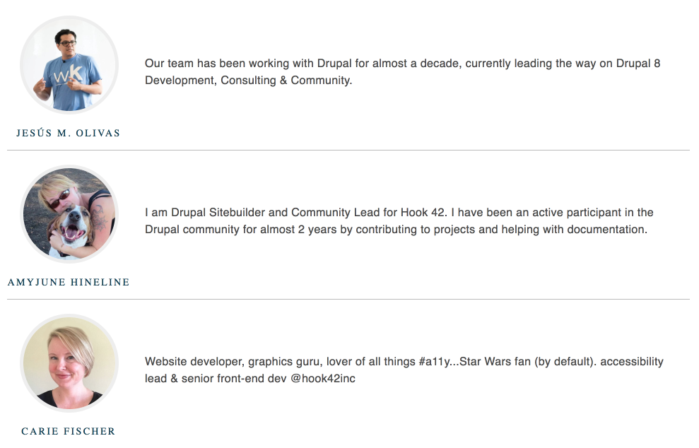

# Component-based Development with Drupal 8

## Creating Components Variations

Component variations is the ability to display a component differently than its original state.  A variation could be as simple as showing text or elements in different color, or more advanced like changing the order or content or content itself.

Let's first create a variation of the Speaker card component in the styleguide then we will go back to Drupal to implement the variation.


**featured-speakers.json**
```json
{
  "items": [
    {
      "name": "Jes&#xfa;s M. Olivas",
      "photo": "",
      "bio": "Our team has been working with Drupal for almost a decade, currently leading the way on Drupal 8 Development, Consulting & Community."
    },
    {
      "name": "AmyJune Hineline",
      "photo": "",
      "bio": "I am Drupal Sitebuilder and Community Lead for Hook 42. I have been an active participant in the Drupal community for almost 2 years by contributing to projects and helping with documentation."
    },
    {
      "name": "Carie Fischer",
      "photo": "",
      "bio": "Website developer, graphics guru, lover of all things #a11y...Star Wars fan (by default). accessibility lead & senior front-end dev @hook42inc"
    }
  ]
}
```
Since we will have multiple speakers, we need to add each one of them in an array so we can loop through them.  The code above shows the `items` array in which we have outlined each speaker.  The fields for each speaker are `name`, `photo`, and `bio`.


**featured-speakers.twig**
```twig
{{ attach_library('shiny/featured-speakers') }}

<section class="featured-speakers">
  
    
  
</section>
```
First we created a **loop** to iterate through the _items_ array.  For each item (speaker), in the array, we include the _speaker_ card and pass the **key | value** from the JSON object.  The entire collection of speakers is wrapped in a `<section>` element.


**featured-speakers.scss**
```scss
// Featured Speakers
//
// This is the featured-speakers component.
//
// Markup: featured-speakers.twig
//
// Style guide: Components.Featured Speakers

// Import site utilities.
@import '../../global/utils/init';


.featured-speakers__card {
  display: flex;
  flex-direction: column;

  @include breakpoint($bp-sm) {
    flex-direction: row;
  }

  &.speaker {
    border: 0;
    border-bottom: 1px solid $color-silver;
    max-width: inherit;

    &:last-child {
      border: 0;
    }
  }

  .speaker__header {
    background: none;
    flex: 0 0 175px;
    padding-bottom: 0;
  }

  .speaker__photo img {
    border: 5px solid $color-gallery;
  }

  .speaker__content {
    align-items: center;
    display: flex;
    min-height: inherit;
    margin-top: 0;

    @include breakpoint($bp-sm) {
      margin-top: 20px;
    }
  }

  .speaker__name {
    color: $color-blue;
    font-size: 14px;
    text-transform: uppercase;
  }
}
```
So we took the original spekaer styles and overrode to achieve the new look.

In the next excercise we will jump back into Drupal to create a new Content Type (Featured Speakers), in which we will add an entity reference field for the Speaker card.  The difference between the Featured Speakers Content type Speaker card field is that this time it will accept multiple instances of the speaker card.


### Compiling Styleguide

```
npm run build
```

#### Preview of the Featured Speakers component



#### View component in styleguide
Let's take a look to make sure our new component looks and behaves as expected

```
http://your-local/themes/custom/shiny/dist/style-guide/
```

---

Previous exercise:  [Integrate components](6-integrating-components.md)

Next exercise:  [Integrating Featured Speakers](8-integrate-featured-speakers.md)
